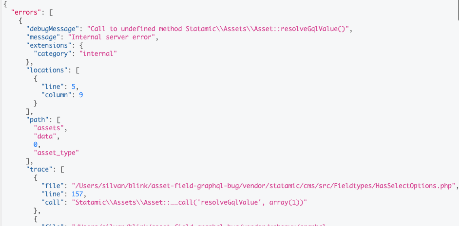

Run this query in graphql 

```graphql
query MyQuery {
  assets(container: "assets") {
    data {
      ... on Asset_Assets {
        asset_type {
          value
        }
      }
    }
  }
}
```


Leads to 
